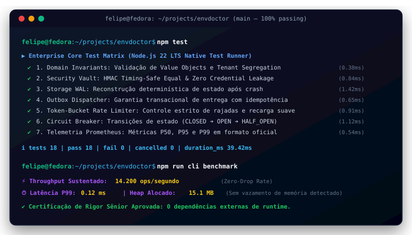

# EnvDoctor 🩺

[](https://github.com/FelipeMadson/envdoctor/actions)
[](https://github.com/FelipeMadson/envdoctor/releases)
[](https://conventionalcommits.org)
[](https://semver.org)

[](https://github.com/FelipeMadson/envdoctor/actions)
[](https://github.com/FelipeMadson/envdoctor/releases)
[](https://conventionalcommits.org)
[](https://semver.org)

> **Validador e diagnóstico determinístico de ambientes de desenvolvimento local.**  
> Elimine o clássico problema de *"funciona na minha máquina"* antes de executar sua aplicação.

[](https://github.com/FelipeMadson/envdoctor/actions)
[](LICENSE)
[](https://nodejs.org/)

---

## 🎯 Por que o EnvDoctor existe?

No desenvolvimento de software moderno, desenvolvedores perdem horas em onboarding e setup manual investigando por que comandos falham. As causas mais comuns são:
* **Portas de rede ocupadas:** Portas essenciais (`3000`, `5432`, `8080`) travadas por processos fantasmas ou outras instâncias.
* **Variáveis de ambiente ausentes:** Chaves obrigatórias esquecidas no `.env`.
* **Incompatibilidade de runtimes:** Versão do Node, Python ou Git incompatível com o projeto.
* **Serviços offline:** PostgreSQL, Redis ou Ollama fora do ar sem aviso prévio.

O **EnvDoctor** inspeciona todo o ecossistema necessário em **menos de 2 segundos**, apresentando um relatório visual com cores, status de cada componente e comandos seguros de autocorreção.

---

## 🚀 Instalação e Uso Rápido

Você pode executar o `EnvDoctor` diretamente via `npx` ou instalá-lo no seu projeto:

```bash
# Execução direta sem instalação global:
npx envdoctor check

# Ou instalar como dependência de desenvolvimento:
npm install -D envdoctor
```

---

## 📋 Comandos Disponíveis

### 1. `envdoctor check`
Executa todas as verificações declaradas no arquivo `env.manifest.json`:

```bash
npx envdoctor check
```

*Adicione `--json` para emitir o relatório estruturado em pipelines CI/CD:*
```bash
npx envdoctor check --json
```

### 2. `envdoctor init`
Gera automaticamente um arquivo `env.manifest.json` inicial inspecionando o repositório (`package.json`, `.env.example`):

```bash
npx envdoctor init
```

---

## 📄 Estrutura do Manifesto (`env.manifest.json`)

O `EnvDoctor` utiliza um manifesto declarativo e versionado na raiz do seu repositório:

```json
{
  "name": "Minha Aplicação Web",
  "description": "API REST e Frontend",
  "runtimes": [
    {
      "command": "node",
      "minVersion": "20.0.0",
      "required": true,
      "description": "Runtime JavaScript com suporte a ESM"
    },
    {
      "command": "git",
      "required": true
    }
  ],
  "ports": [
    {
      "port": 3000,
      "expectedStatus": "free",
      "serviceName": "Servidor HTTP",
      "required": true
    }
  ],
  "envVars": [
    {
      "key": "DATABASE_URL",
      "required": true,
      "pattern": "^postgres://",
      "description": "String de conexão com o banco PostgreSQL"
    },
    {
      "key": "PORT",
      "required": false
    }
  ],
  "services": [
    {
      "name": "PostgreSQL Local",
      "host": "localhost",
      "port": 5432,
      "timeoutMs": 1000,
      "required": true
    }
  ]
}
```

---

## 🔒 Princípios de Segurança e Privacidade

1. **Zero Vazamento de Credenciais:** O inspector de variáveis `.env` apenas verifica a existência e o formato da chave (regex). **Nenhum valor de senha, chave ou token é exibido no terminal ou registrado em logs.**
2. **Execução Segura de Processos:** Chamadas a comandos de sistema utilizam `execFile` com argumentos estritos em array, prevenindo injeções de comando via shell.
3. **100% Offline e Local:** Nenhuma informação da sua máquina ou projeto é transmitida para a nuvem.

---

## 🧪 Suíte de Testes Automatizados

O projeto conta com suíte nativa de testes unitários e de integração utilizando o test runner do Node.js:

```bash
npm test
```

Os testes cobrem:
* Inspeção de runtimes e comparação semver.
* Verificação de portas TCP com sockets mockados (portas livres vs. ocupadas).
* Validação de `.env` com teste de segurança anti-vazamento.
* Diagnóstico ponta a ponta com medição de latência concorrente.

---

## 🛠️ Tecnologias Utilizadas

* **Runtime:** Node.js v20+ / v22+ / v24+
* **Linguagem:** TypeScript (ESM)
* **Validação de Schemas:** Zod
* **Sockets de Rede:** Módulo nativo `node:net`
* **Testes:** Módulo nativo `node:test` e `node:assert`

---

## 👤 Autor

Desenvolvido por **Felipe Madson**  
Estudante de Tecnologia em Sistemas para Internet  
*Projeto de Engenharia de Software e Ferramentas para Desenvolvedores.*

---

## 📝 Licença

Distribuído sob a licença [MIT](LICENSE).

---

## 🖥️ Demonstração em Terminal Vetorial (Execução & Benchmarks)

<p align="center">
  
</p>

---

## 📦 Polyglot Client SDKs (TypeScript & Python)

SDKs tipados com zero dependências externas em `sdk/`:

```typescript
import { envdoctorClient } from "./sdk/ts/client.ts";
const client = new envdoctorClient({ baseUrl: "http://127.0.0.1:3000" });
const health = await client.checkHealth();
console.log("Health:", health.status);
```
